# Husman Moderna

[The actual website](https://husman-moderna-b3b264b75487.herokuapp.com/home/)

Husman Moderna is a full-stack website created for a fictitious restaurant where the user can read the menu, book a table, leave reviews, etc. As a user, you first create an account to gain access to all functions on the website, but even non-registered visitors have access to the menu, can learn about the restaurant and read reviews from the community.

This website not only aims to simplify the reservation process but also fosters a vibrant community of food enthusiasts eager to explore and discuss the culinary delights Husman Moderna has to offer.

## Content Index

* [User Experience (UX)](#user-experience-ux)
    - [Target Audience](#target-audience)
    - [User Stories](#user-stories)
* [Features](#features)
    - [Sign Up](#sign-up)
    - [Menu](#menu)
    - [Book Reservation](#book-reservation)
    - [Leave Review](#leave-review)
    - [About Page](#about-page)
    - [Future Features](#future-features)
* [Design](#design)
    - [Colour Scheme](#about-page)
    - [Typography](#typography)
    - [Logo, Icons and Favicon](#logo-icons-and-favicon)
    - [Wireframes](#wireframes)
    - [Flow Diagram](#flow-diagram)
    - [Database Plan](#database-plan)
* [Technologies Used](#technologies-used)
    - [Programming Languages](#programming-languages)
    - [Frameworks, Libraries and Programs Used](#frameworks-libraries-and-programs-used)
* [Agile](#agile)
* [Testing](#testing)
    - [Automated Testing](#automated-testing)
    - [Manual Testing](#manual-testing)
    - [Bugs](#bugs)
    - [Unfixed Bugs](#unfixed-bugs)
    - [Lighthouse](#lighthouse)
    - [Validator Testing](#validator-testing)
    - [Python Testing](#python-testing)
    - [JavaScript Testing](#javascript-testing)
* [Deployment](#deployment)
    - [GitHub Deployment](#github-deployment)
    - [Forking](#forking)
    - [Cloning](#cloning)
    - [Heroku Deployment](#heroku-deployment)
* [Credits](#credits)
    - [Content](#content)
    - [Code](#code)
* [Media](#media)
* [Acknowledgment](#acknowledgment)

## User Experience (UX)

### Target Audience

Users who want to book a table at a restaurant that serves Swedish home cooking.

### User Stories

#### A. First Time Visitor Goals

        1. As a first time visitor, I want to easily understand the main purpose of the website so that I can learn what the site offers without unnecessary navigation.

        2. As a first-time visitor, I want to be able to effortlessly navigate the menu to quickly decide what interests me.

        3. As a first-time visitor, I want to see reviews from other customers to estimate the quality of the restaurant.

#### B. Returning Visitor Goals

        1. As a Returning Visitor, I want to quickly make a reservation without having to re-enter my details every time, using an account-based system for convenience.

        2. As a Returning Visitor, I want to leave reviews and share my experiences at the restaurant.

#### C. Frequent User Goals
        1. As a Frequent User, I want to manage my reservations and possibly modify upcoming reservations without hassle.

        2. As a Frequent User, I want to be able to update or delete my old reviews easily.

## Features

### Sign Up

### Menu

### Book Reservation

### Leave Review

### About Page

### Future Features

- Creating logic that ensures that double bookings do not take place at the restaurant, i.e. that there is a block if the restaurant is fully booked during a specific day/time.

## Design

### Colour Scheme

- [Color Picker](https://imagecolorpicker.com/) was used to ensure the same color shades were used throughout the website.

- The web page colour theme includes two specific colours as follows. The colours reflect the restaurant's food theme, Swedish home cooking. Beyond these colours, the page is relatively stripped down, colour-wise:

RGBA (255,204,0,255)
RGBA (57,96,127,255)

- Colour shades and shadows have been used for action buttons, which simplifies navigation.

### Typography

The website uses font-family: 'Playfair Display' for its headings, to create a sense of elegance, and font-family: 'Lato' for body text.

-   The fonts used were imported from [Google Fonts](https://fonts.google.com/)

### Logo, Icons and Favicon

- This page was used to create a favicon for the webpage: [Favicon](https://favicon.io/)

- [ChatGPT](https://chat.openai.com/) was used to create the logo for the webpage

- The icons in the footer were taken from [Font Awesome](https://fontawesome.com/)

### Wireframes

Wireframes, used as starting points for the design of the website, were created with Microsoft Paint:

- Desktop Wireframe

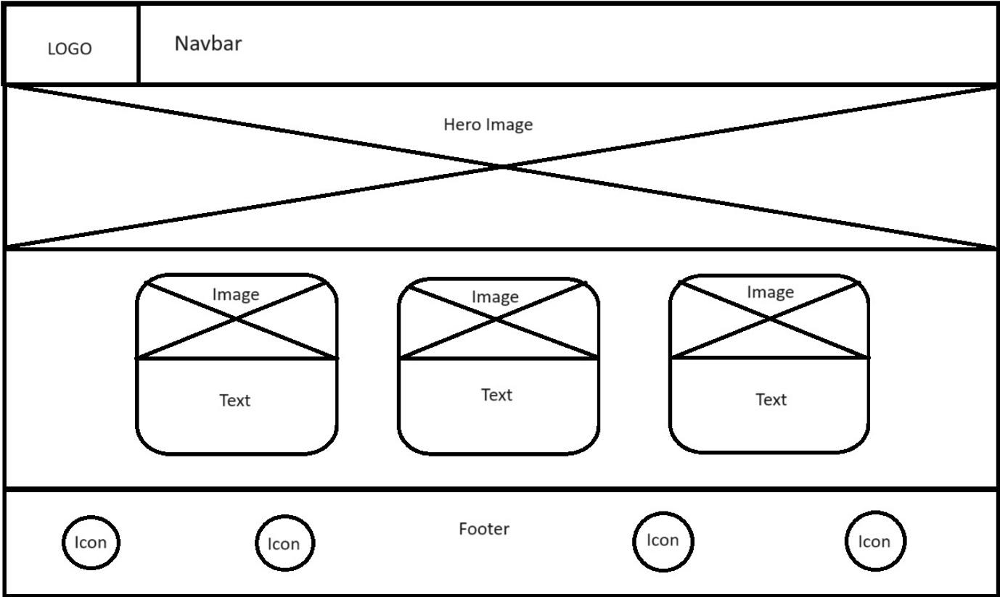

- Mobile Wireframe

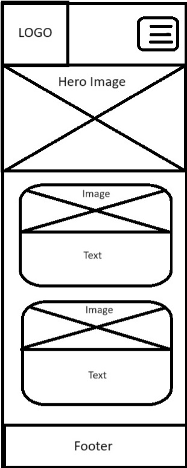

### Flow Diagram

Flow diagrams was created using [Lucidchart](https://lucidchart.com/)

- Flow chart for admin:

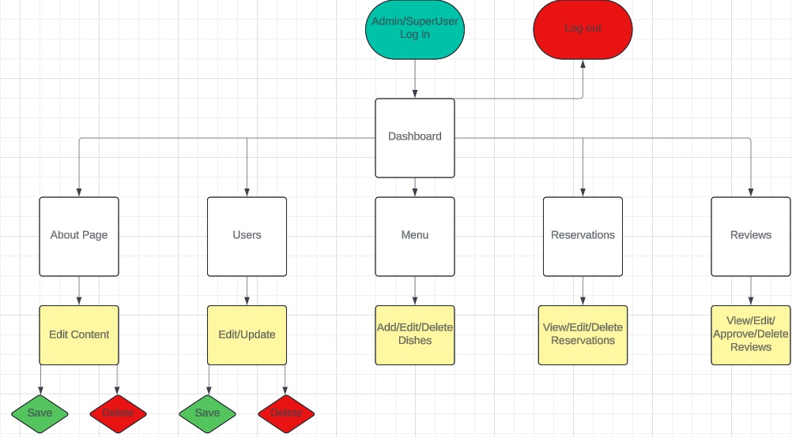

- Flow chart for user:

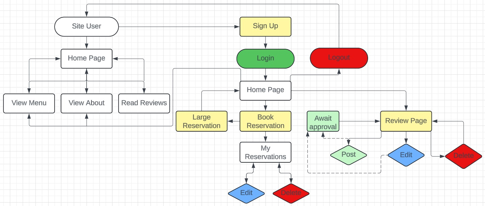

### Database Plan

Entity Relationship Diagram (ERD) was created using OpenOffice

- ERD for the reservation model:

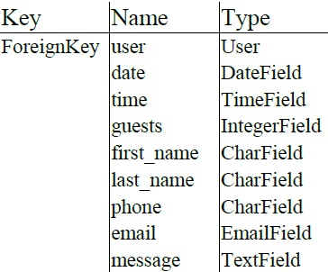

- ERD for the review model:

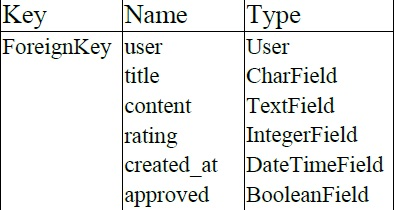

## Technologies Used

### Programming Languages

-   [HTML5](https://en.wikipedia.org/wiki/HTML5)
-   [CSS3](https://en.wikipedia.org/wiki/Cascading_Style_Sheets)
-   [Python](https://www.python.org/)
-   [JavaScript](https://en.wikipedia.org/wiki/JavaScript)

### Frameworks, Libraries and Programs Used

-   [GitPod](https://www.gitpod.io/):
The IDE where the site was built.
-   [GitHub](https://github.com/):
To host and store the data for the site.
-   [Heroku](https://www.heroku.com/):
Used to deploy the project.
-   [ElephantSQL](https://customer.elephantsql.com/):
Used to store PostgreSQL database.
-   [Django](https://www.djangoproject.com/):
Framework used to create the web page.
-   [Bootstrap](https://getbootstrap.com/):
CSS framework used as a tool to style the web page.
-   [EmailJS](https://www.emailjs.com/):
EmailJS is implemented to receive emails when the user wishes to make large reservations. 

## Agile

The project was developed following Agile principles, with the Project Board and Issues features on GitHub playing a central role in its organization.

-   [My Project Board](https://github.com/users/merin86/projects/6)

This instruction video was used to help create the Kanban Board: [Agile Guide](https://www.youtube.com/watch?v=U_dMihBgUNY)

## Testing

### Automated Testing

Automated testing has been implemented in the projects workspace. Views and Models have been tested within all affected apps. The auto-generated "tests.py" files have been deleted and instead "tests" folders have been added to affected apps. Within the tests folders, the test files have been added with clear names that describe what is being tested. This is to create clarity around the structure of the project. The Home app has no tests, as it was not relevant. Also, within each "tests" folder, an empty file called init.py has been created. This makes it possible for Django's test runner to discover and run tests contained within that directory or its subdirectories.

The automated testing is not comprehensive, but it gives an indication of the developer's ability to create automated tests.

### Manual Testing

#### Admin

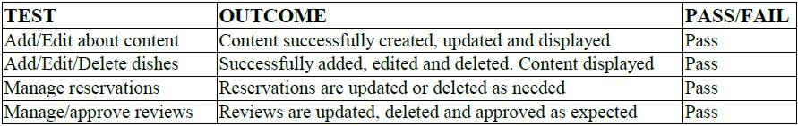

#### User

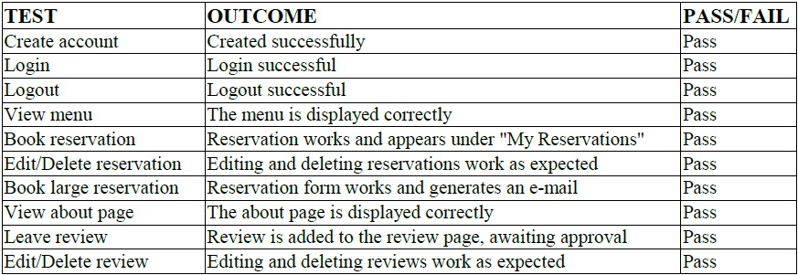

- After testing in dev tools, it is confirmed that the website is responsive across different screen sizes.

### Bugs

- At times, during construction, styles could not be alternated because Bootstrap did override custom CSS styles. In these cases, an "!important" marker was added to this style, to ensure that the style was implemented.

- My mentor pointed out that the forms accepted spaces. This was resolved with new functions within the forms.py files that generate error messages when entering spaces.

- Reservations accepted bookings on dates that have passed. This was solved with equivalent functions as mentioned above.

### Unfixed Bugs

- A span element with the class: "helptext" seems to have disappeared or is hidden somewhere within the workspace. More information on this under [Validator Testing](#validator-testing).

### Lighthouse

#### Mobile

- Home page:

Performance is somewhat low because the images are large (approx. 500 kb). The images are taken from Pexels and then compressed with TinyPNG, but the images are still quite large.

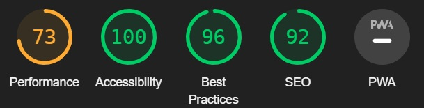

- About page:

Performance is somewhat low here as well, due to large images.

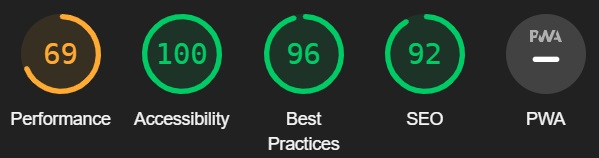

- Menu page:

Hero image is a large file, which affects performance.

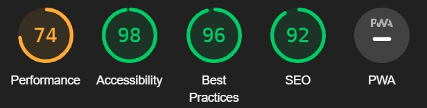

- Reservation page:

Hero image is a large file, which affects performance.

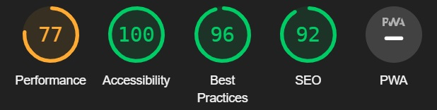

- Review page:

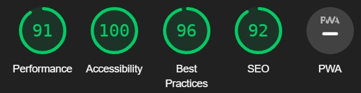

#### Desktop

- Home page:

Performance works better here on desktop than on mobile.

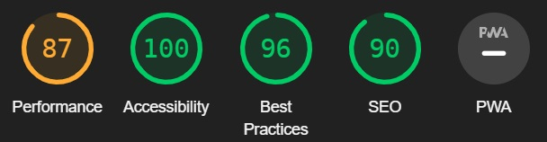

- About page:

Performance is somewhat low here as well, due to large images.

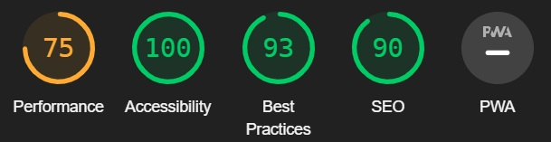

- Menu page:

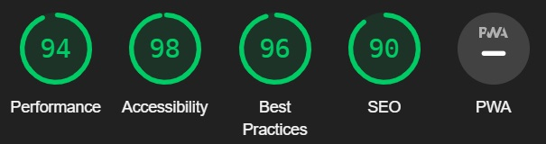

- Reservation page:

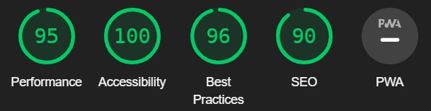

- Review page:

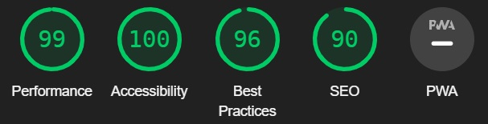

### Validator Testing

#### HTML

HTML validation was completed using [W3 Validator](https://validator.w3.org/)

- When the signup page was run through W3 Validator, these error messages appeared. However, the file that should contain this span does not seem to be visible anymore in my workspace. It should be under some folder generated when Django AllAuth was installed (specifically within the login or signup file). I have not been able to resolve this issue and have therefore added it under [unfixed bugs](#unfixed-bugs).

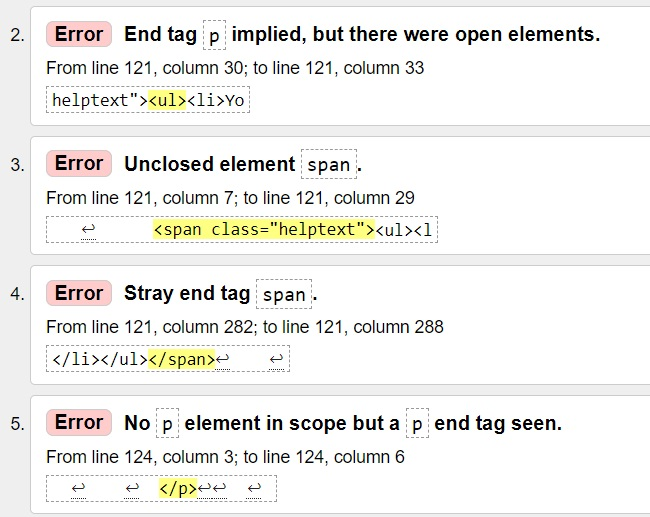

- All other pages pass the validation without any issues

#### CSS

CSS validation was completed using [W3 Validator](https://jigsaw.w3.org/css-validator/)

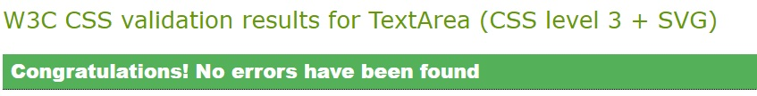

### Python Testing

To test that the Python code meets the PEP8 standard, [CI Python Linter](https://pep8ci.herokuapp.com/) was used.

Python files tested:

- admin
- models
- urls
- views
- forms
- tests

Only small errors were detected, such as too few blank lines, line too long and no newline at end of file. All these have now been rectified.

### JavaScript Testing

To test the JavaScript code [JSHint](https://jshint.com/) was used.

JavaScript files tested:

- auto_dismiss_messages.js
- reservations.js
- reviews.js
- JavaScript within my_reservations.html

The code does not generate any warnings.

## Deployment

### GitHub Deployment

### Forking

### Cloning

### Heroku Deployment

## Credits

### Content

- The content of the web page is created by the developer.

- The text content on the web page has been partly modified by Bengt Liljenroth in order to achieve a neater language.

### Code

#### Tutorials

- The walkthrough "I Think Therefore I Blog" from [Code Institute](https://codeinstitute.net/) has been used as a pillar to create the structure.

- [Django Recipe Sharing Tutorial](https://www.youtube.com/watch?v=sBjbty691eI&list=PLXuTq6OsqZjbCSfiLNb2f1FOs8viArjWy) has also been used as a support to create structure for various functions. 

#### Websites

- [Django documentation](https://docs.djangoproject.com/en/5.0/) has been used frequently to create the web page.

- This previous PP4 project has been used as a source of inspiration and also as a tool, using DevTools, for various codes (especially in the creation of the menu and footer): [Tasty Bites](https://tasty-bites-rb-427304cf20b7.herokuapp.com/)

- [Bootstrap Docs](https://getbootstrap.com/docs/5.3/getting-started/introduction/) have been used to get the right classes.

- [EmailJS docs](https://www.emailjs.com/docs/) were used to implement their functionality correctly in the project.

- This page has been used as a tool for creating pseudo-classes: [Meet the Pseudo Class Selectors](https://css-tricks.com/pseudo-class-selectors/)

- This page has been used to create the correct flexbox attributes: [A Complete Guide to Flexbox](https://css-tricks.com/snippets/css/a-guide-to-flexbox/#flexbox-background)

- The following web page has been used as a learning tool and source of inspiration to create own codes for the website: [W3Schools](https://www.w3schools.com/)

- With the help of [MDN Web Docs](https://developer.mozilla.org/en-US/), the automated tests for the project were created.

- This README.md has been used as a template to create this README: [My Fishing Adventure - README.md](https://github.com/markdaniel1982/MD82-P4/blob/main/README.md#media)

#### Other References

- This page was used to generate a secret code: [Djecrety](https://djecrety.ir/)

- This page was used to find the correct CDN link to access Bootstrap: [CDNJS](https://cdnjs.com/)

## Media

All images in this project are taken from [Pexels](https://www.pexels.com/) and then resized via [TinyPNG](https://tinypng.com/)

Video on about page was taken from [Pexels](https://www.pexels.com/) and resized with [Cloud Convert](https://cloudconvert.com/). Later it was uploaded via [Vimeo](https://vimeo.com/), converted to a GIF file with a URL added to the "About" page.

## Acknowledgment

I would like to thank my mentor, Jubril Akolade, for all the help he has given me.

For help with manual testing:

- Annika Magnusson
- Anthony Oweleke
- Björn Johansson
- Cecilia Magnusson
- Klas Magnusson
- Saba Abbasi